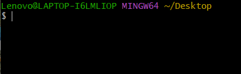
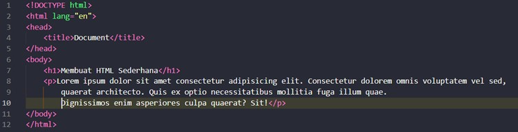
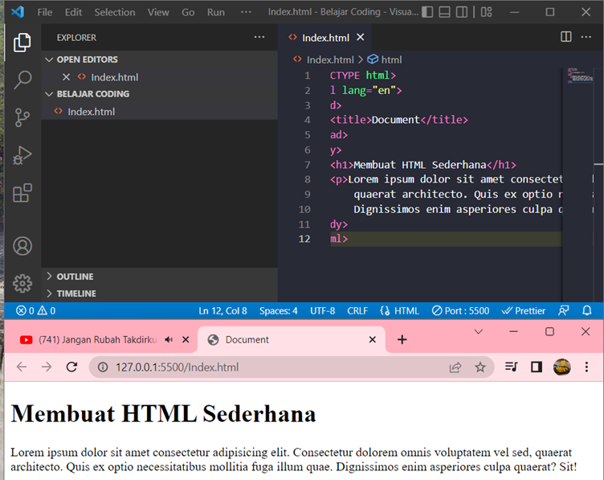
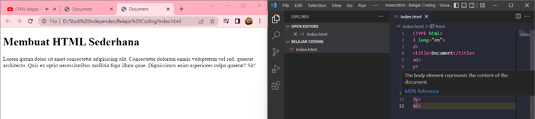
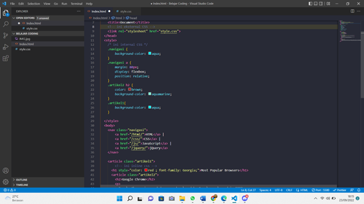
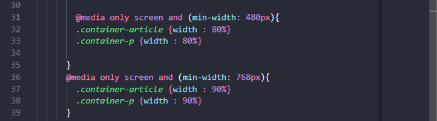
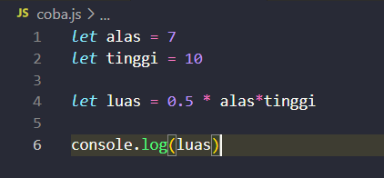
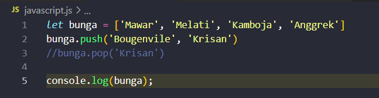

# __Unix Command Line__
Pada hari senin diadakan live class tentang materi Web Development Basic pada sesi live class ini pemateri menyampaikan materi tentang Unix, Git&Github. 

	Shell merupakan yang menerima perintah, kemudian meneruskan perintah tersebut ke system untuk dieksekusi. Command line atau "command line interface", sebenarnya yang dimaksud adalah shell yang berbasis teks.
 

Di CLI untuk sistem operasi mirip Unix, default shell yang digunakan biasanya adalah bash. macOS sendiri, sejak macOS Catalina sudah mengganti default shellnya menjadi ZSH. Tapi untuk kursus ini saya akan menggunakan Bash. Di Bash, jika karakter terakhir dari promptnya adalah "hash mark" (#), artinya kita punya priviliges superuser.

	Saat pertama kali membuka terminal, kita akan dihadapkan dengan tampilan seperti ini. 

	Ini disebut "shell prompt" dan tampilan ini muncul ketika shell siap menerima input.
	Artinya, antara kita login sebagai "root user" atau kita menggunakan terminal emulator yang menyediakan privliges superuser.File System Tree: Cara sistem operasi menyusun file-filenya dalam bentuk hierarki atau tree. 

__Berikut adalah beberapa perintah yang saya pelajari di unix :__

* Pwd (Print working directory) : Untuk mengetahui kita sedang berada di direktori mana, kita bisa menggunakan command  pwd.
* ls (lists) : Command untuk melihat isi file yang ada di sebuah direktori.
* cd (change directory) : Command untuk berpindah direktori.
* command untuk melihat isi files :
	* Head : Command untuk melihat beberapa line awal dari sebuah file text.
	* Tail : Command untuk melihat beberapa line awal dari sebuah file text.
	* Cat : Command untuk melihat beberapa line awal dari sebuah file text.
	* Touch : Command untuk membuat sebuah file.
* Cp : Command untuk mengcopy files atau directory.
* mv (move) : Command untuk memindahkan files atau directory. Bisa digunakan untuk rename.
* rm(remove) : Command untuk menghapus file atau directory.

# __Git & Github__

	Git adalah aplikasi yang dapat melacak setiap perubahan yang terjadi pada suatu folder atau file. biasanya digunakan oleh para programmer sebagai tempat penyimpanan file pemrograman mereka, karena lebih efektif. 
__Perbedaan antara Git dan Github :__

Git adalah aplikasi yang dapat melacak setiap perubahan yang terjadi pada suatu folder atau file. biasanya digunakan oleh para programmer sebagai tempat penyimpanan file pemrograman mereka, karena lebih efektif.Sedangkan, GitHub menyediakan interface grafis berbasis cloud sebagai tempat untuk melakukan seluruh tugas.

__Alur kerja dari Git dan Github__
* Git config : konfigurasi git untuk set up awal.
* Git init : menginisialisasi folder/direktori baru(Repository adalah direktori proyek yang kita buat.) /yang telah dibuat agar 	Ketika ada perubahan yang terlacak oleh git.
* Git add : menambahkan file bar uke folder yang telah diinisialisasi(status filenya masih untracked files).
* Git commit -m : setelah di commit  status filenya akan berubah menjadi modified files.
* Git status : menampilkan file yang telah di modifikasi di direktori kerja.
* Git log  : menampilkan commit terakhir pada cabang branch.

================================================
# __HTML (Hypertext Markup Language)__
Pada hari selasa diadakan live class tentang materi Web Development Basic pada sesi live class ini pemateri menyampaikan materi tentang html. 

	HTML tidak termasuk kedalam Bahasa pemrograman melainkan hypertext language penyusun kerangka website. HTML bersifat statis. HTML hanya bertugas menampilkan konten yang diminta oleh developer. 

Contoh konten yang dapat ditampilkan seperti Text, Image, Video, Link, dll .Ada 2 tools utama yang harus dipersiapkan untuk membuat HTML yaitu Browser & Code Editor Dalam html teradapat tag utama yaitu tag head dan body.

Ada beberapa tag yang digunakan yaitu tag h1 / Heading (biasanya digunakan sebagai judul dalam sebuah halaman website, heading terdapat 1 sampai 6 tingkatan sub heading. Kemudian tag p digunakan untuk teks paragraph, tag h1 dan p terdapat pada bagian body HTML. 

__Dibawah ini beberapa tag HTML dan pengertiannya__
* Tag h1 : untuk membuat judul.
* Tag p : untuk membuat pargraf. 
* Tag b : untuk membuat tulisan tebal.
* Tag i : untuk membuat tulisan miring.
* Tag ol : untuk membuat list.
* Tag a : untuk menyisipkan link. 
* Tag img : untuk menyisipkan gambar.

Elemen semantic adalah elemen yang dengan jelas menggambarkan artinya bagi browser dan pengembang.contohnya tag nav, tag article, tag section. Berikut tag semantic HTML , elemen semantik dengan jelas menggambarkan artinya bagi browser dan pengembang. contoh elemen semantic : form , table, dan article Jelas mendefinisikan isinya.

 __Contoh HTML sederhana__

 

 	didalam kode diatas terdapat tag h1 untuk membuat judulnya dan tag p sebagai isinya

__Cara mengakses konten HTML ada 2 cara yaitu menggunakan live server dan secara manual__

    * Menggunakan Live Server

    * Secara manual

__Langkah-langkah mendeploy file HTML ke Netlify__:

* Buat file HTML terlebih dahulu di VS code.
* Pastikan file HTML berada disuatu folder.
* Kemudian lakukan inisialisasi _git init_ melalui terminal VS code.
* Lalu lakukan git add pada file tersebut.
* Setelah itu lakukan commit _(git commit -m "pesan")_.
* Lalu cek status file dengan _git log_ untuk mengecek status commit terakhir.
* Setelah itu buat repositori pada GitHub _(Pastikan anda sudah memiliki akun, jika belum dapat melakukan sign-up terlebih dahulu)_.
* Kemudian koneksikan folder yang sudah dicommit dengan repositori Github dengan perintah _git remote add origin_ (link repository).
* Setelah terkoneksi lakukan percabangan dengan _git branch -M main_.
* Lalu lakukan _git push -u origin main_ untuk menambahkan file ke repository.

=================================================

# __CSS(Cascading Style Sheets)__

Pada hari rabu diadakan live class tentang materi Web Development Basic pada sesi live class ini pemateri menyampaikan materi tentang CSS. 

	CSS adalah bahasa yang digunakan untuk mendesain halaman website. Dengan CSS, kita bisa mengubah warna, menggunakan font custom, editing textformat, mengatur tata letak, dan lainnya. 

__Beberapa jenis penggunaan CSS diantara lain:__
* Inline style : CSS yang ditulis langsung di dalam tag HTML-nya di tag pembuka. Inline style akan di eksekusi terlebih dahulu Ketika ada style yang sama
* Internal style : CSS ini berapa langsung di dalam file HTML-nya, tepatnya di dalam tag head dan diapit dengan tag style.
* Eksternal style : CSS ini adalah jenis CSS yang penulisan codenya secara terpisah dan beresktensi .css untuk nama filenya. 

	Peran CSS pada web development Dengan CSS, kita bisa mengubah warna, menggunakan font custom, editing text format, mengatur tata letak, dan lainnya. Beberapa jenis penggunaan CSS diantara lain 
	
__Berikut beberapa styling dalam css :__
* Background-collor : mengubah warna background 
* Color :memberikan warna pada text 
* Padding : jarak antara konten dengan elemen 
* Margin : mengatur jarak element 1 dengan element lainya 
* Border radius : untuk membuat suatu element memiliki tepian yang elips atau umumnya disebut sudut lengkungan.
*  
__contoh penerapan inline CSS dan Internal CSS__

metode responsiv web design menggunakan CSS

	ketika lebar layar 480px, maka komponen artikel akan menyesuaikan ukurannya sebesar 80% dari ukuran defaultnya.

	ketika lebar layar 768px, maka komponen artikel akan menyesuaikan ukurannya sebesar 90% dari ukuran defaultnya.

=================================================
# __Algoritma & data Structure__
Pada hari kamis diadakan live class tentang materi Web Development Basic pada sesi live class ini pemateri menyampaikan materi tentang Algoritma & data structure.

	Algoritma adalah deskripsi berupa step-step yang dibutuhkan untuk menyelesaikan suatu masalah. 
	
	Sedangkan 
	
	Data struktur digunakan untuk mengelola/manajemen sebuah data - Dan Algoritma yang akan menyelesaikan suatu permasalahan menggunakan data tersebut. 
Algoritma di sini bermanfaat untuk membantu berpikir secara sistematis dan terstrukur untuk menyelesaikan masalah. Membuang hal-hal yang tidak diperlukan dan fokus untuk mencari solusi dari permasalahan yang saya hadapi. 

__Contoh algoritma sederhana :__

	Algoritma menghitung luas segitiga

	1. Mulai 
	2. Masukan alas 
	1. Masukkan tinggi 
	1. Proses, L = ½*alas*tinggi 
	1. Menampilkan luas segitiga 
	1. selesai

__Menerapkan algoritma ke dalam bahasa pemrograman _Javascript___

# __Big-O Notation__

	Notasi Big-O adalah sebuah cara atau metode untuk melakukan analisa terhadap sebuah algoritma pemrograman terhadap waktu eksekusi. Tentang seberapa efisien dan kompleksitas barisan kode dalam dimensi waktu. Notasi big O merupakan skenario terburuk dari sebuah algoritma, dan biasanya terdapat notasi n yang merepresentasikan jumlah masukan.

| Kompleksitas | Operasi |
| ------------ | :-----: |
| O(1) | Menjalankan sebuah perintah |
| O(1) | Mendapatkan sebuah item dari array, objek atau variabel |
| O(log n) | Pengulangan yang berkurang setengahnya setiap iterasi |
| O(n2) | Pengulangan dalam pengulangan |
| O(n3) | Pengulangan dalam pengulangan dalam pengulangan |

__Menerapkan salah satu struktur data dalam javascript.__

	Setiap data dalam Array memiliki indeks dimulai dari index ke 0. Metode push() pada kode diatas akan menambahkan data ke dalam array dari ekor atau belakang, dan method pop() akan menghapus array yang ada di paling belakang.

=================================================================
# __Javascript__

Pada hari jumat diadakan live class tentang materi Web Development Basic pada sesi live class ini pemateri menyampaikan materi tentang Javascript. 

	Javascript digunakan untuk logic program pada sebuah website, Javascript juga dapat membuat website menjadi interaktif dan dinamis. JavaScript umumnya dapat dijalankan melalui browser pada device user, dan saat ini browser chrome dan mozilla yang dapat menjalankan  fitur javascript

__Ada 6 tipe data dalam javascript__
*	Number adalah tipe data yang berisi semua angka termasuk bilangan decimal
*	String merupakan tipe data yang berisi grub karakter mulai dari huruf, spasi. Symbol , dll. Dalam penulisannya diawali dan diakhiri dengan single quotes (‘) atau double quotes(“)
*	Tipe data boolean adalah tipe data yang hanya mempunyai 2 buah nilai yaituTRUE (benar) or FALSE (salah).
*	Null dapat diartikan sebagai variable/data yang tidak memiliki nilai
*	Undefined adalah tipe data yang tidak merepresentasikan varible/ data yang tidak ada nilainya. Dalam artian lain memang tidak terdefinisi
*	Tipe data object adalah koleksi data yang saling berhubungan (related). Tipe data pbject dapat menyimpan data dengan tipe data apapun (number, string, boolean, dan lainnya).

__Jenis-jenis operator dalam javascript__
*	Assignment operator digunakan untuk menyimpan sebuah nilai pada variabel.
*	Mathematical Assignment Operator
*	Increment  atau decrement untuk menambah atau mengurangi sebesar 1 nilai.
*	Arithmetic operator adalah operator yang melibatkan operasi matematika. Contoh : Tambah (+),Kuramg (-),Perkalian (*),Pembagian (/),Modulus (%)
*	Comparison operator adalah operator yang membandingkan satu nilai dengan nilai lainnya.
*	Logical operator biasa digunakan untuk sebuah CONDITIONAL pada pemograman. Menghasilkan nilai BOOLEAN yaitu TRUE or FALSE.

## Conditional
	Conditional merupakan statement percabangan yang menggambarkan suatu kondisi. Program akan mengecek kondisi spesifik dan menjalankan perintah berdasarkan kondisi tersebut. yang dicek adalah apakah kondisi tersebut TRUE (benar).Jika TRUE maka code didalam kondisi tersebut dijalankan. Contohnya IF, IF ELSE, ELSE IF

## Looping
	Looping adalah statement yang mengulang sebuah instruksi hingga kondisi terpenuhi atau jika kondisi stop/berhenti tercapai. 

Contohnya FOR LOOP (FOR LOOP digunakan jika kita tahu seberapa banyak nilai pasti untuk pengulangannya), WHILE LOOP (WHILE LOOP digunakan jika kita tidak mengetahui jumlah pasti pengulangan.), dan yang terakhir DO WHILE (Dengan menjalankan pengulangan 1 kali sebelum dilakukan pengecekan kondisi).

# __Pesan dan kesan__

untuk kegiatan satu minggu ini Kesannya menurut saya system pembelajaranya asik , lebih banyak ke praktik dan mengulang materi yang kemarin , penyampaiannya tidak terlalu cepat dan kami diberikan space untuk mencoba kode yang sedang dipresentasikan Pesannya selama satu minggu ini berjalan dengan baik, tidak terlalu cepat dan pemahaman terhadap materi jadi lebih baik. 

__Terimakasih__

_25 September 2022 21.50_
_@lyalfya_