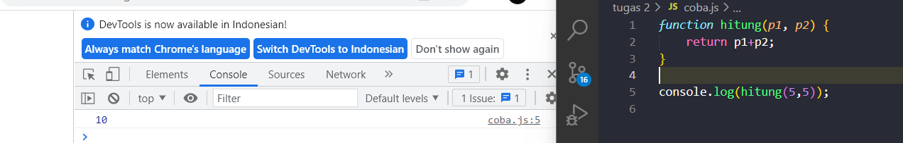
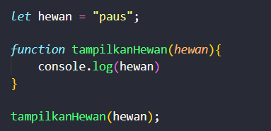
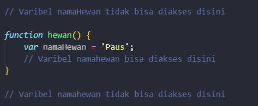
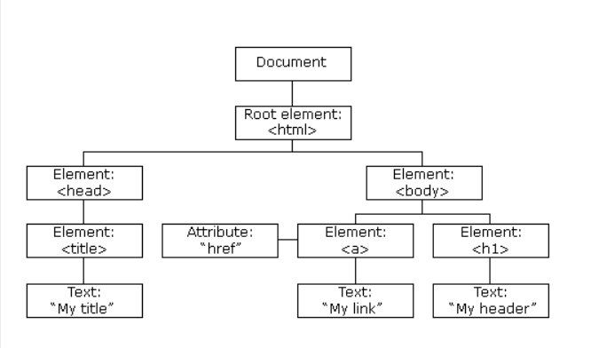
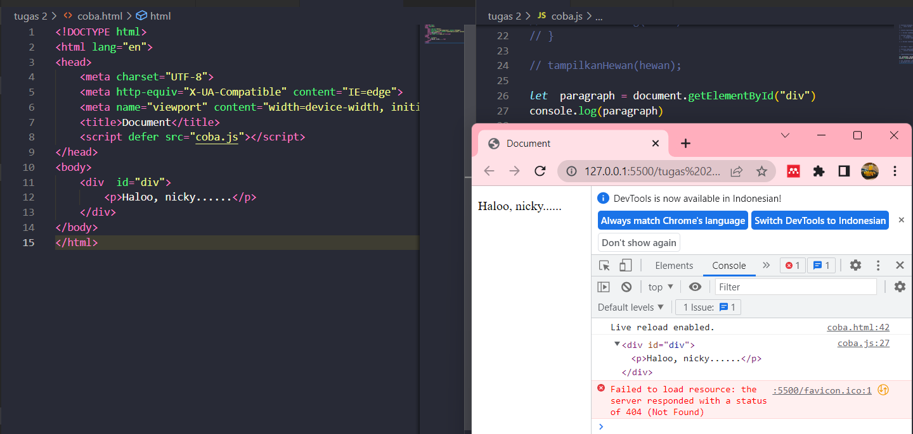
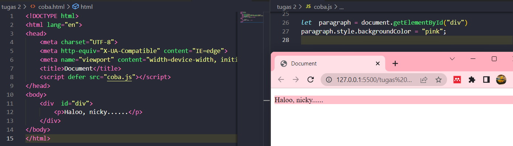
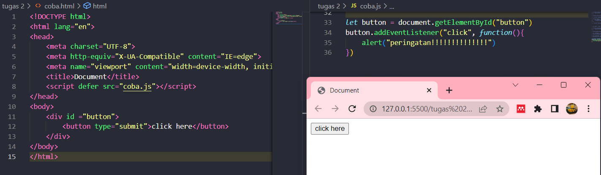
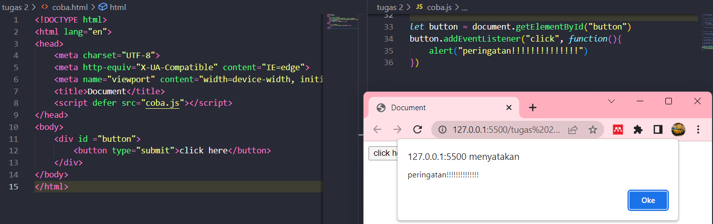

# SCOPE & FUNCTION
	
	Function :
	Function adalah sebuah blok kode dalam sebuah grup untuk menyelesaikan 1 task/1 fitur. Saat kita membutuhkan fitur tersebut nantinya, kita bisa kembali menggunakannya. Cara memanggil function yaitu dengan menuliskan nama functionnya diikuti dengan tanda kurung (). 

## Contoh Function :

## Parameter Function : 
1. Dengan parameter, function dapat menerima sebuah inputan data dan menggunakannya untuk melakukan tugas. 
2. Saat membuat function, kita harus tahu data-data yang dibutuhkan. Argumen Function : nilai yang digunakan saat memanggil function.
3. Jumlah argumen harus sama dengan jumlah parameternya 
4. Jika di function penambahan ada 2 parameter nilai saat membuat function.
5. Saat memanggil function kita gunakan 2 buah nilai argument.

## Jenis-jenis function : 
1. Function helper.
2. Arrow function.
3. Short Syntax Function 

Default paramaters digunakan untuk memberikan nilai awal/default pada parameter function. Default parameters bisa digunakan jika kita ingin menjaga function agar tidak error saat dipanggil tanpa argument. 

	Scope :
	Scope adalah konsep dalam flow data variabel. Menentukan suatu variabel bisa diakses pada scope tertentu atau tidak. 

## Jenis-jenis scope : 
1. Global scope berarti variabel yang kita buat dapat diakses dimanapun dalam suatu file. Agar menjadi Global Scope, suatu variabel harus dideklarasikan diluar Blocks(kode yang berada didalam curly braces {}). 

Contoh Global Scope:

2. Local berarti mendeklarasikan variabel didalam blocks seperti function, conditional, dan looping. variabel hanya bisa diakses didalam blocks saja. Tidak bisa diakses diluar blocks.

Contoh Local Scope:

   

# TIPE DATA
	Himpunan tipe dalam bahasa JavaScript terdiri dari nilai primitive dan non primitive. Nilai primitive adalah Semua jenis tipe data kecuali objek mendefinisikan nilai yang tidak dapat diubah. 

## Tipe data primitive :
1. __Number__ adalah tipe data yang berisi semua angka termasuk bilangan decimal.
2. __String__ merupakan tipe data yang berisi grub karakter mulai dari huruf, spasi. Symbol , dll. Dalam penulisannya diawali dan diakhiri dengan single quotes (‘) atau double quotes(“).
3. __Boolean__ adalah tipe data yang hanya mempunyai 2 buah nilai yaituTRUE (benar) or FALSE (salah).
4. __Null__ dapat diartikan sebagai variable/data yang tidak memiliki nilai
5. __Undefined__ adalah tipe data yang tidak merepresentasikan varible/ data yang tidak ada nilainya. Dalam artian lain memang tidak terdefinisi.
6. __BigInt__ digunakan untuk menyimpan bilangan bulat tanpa batasasan seperti Number. Kita bisa melakukan operasi matematika dengan aman tanpa khawatir hasilnya salah.
 	
## Tipe data non primitive :
1. __Array__ adalah jenis objek yang dapat digunakan untuk menyimpan beberapa nilai, tanpa properti seperti objek. Array memiliki indeks yang dimulai dari nol dengan kata lain elemen atau nilai pertama di dalam array memiliki indeks 0, elemen berikutnya memiliki indeks 1 dan seterusnya.
2. __object__ adalah koleksi data yang saling berhubungan (related). Tipe data pbject dapat menyimpan data dengan tipe data apapun (number, string, boolean, dan lainnya).
   

# JAVASCRIPT & HTML DOM
	DOM disini tidak termasuk dalam bagian dari JavaScript dan DOM ini merupakan sebuah web API untuk membangun website. DOM merupakan singkatan dari Document Object Model.Artinya, dokumen (HTML) yang dimodelkan dalam sebuah objek.Objek dari dokumen ini menyediakan sekumpulan fungsi dan atribut/data yang bisa kita manfaatkan dalam membuat program Javascript. Inilah yang disebut API (Application Programming Interface).

__Objek DOM di javascript Bernama document. Objek ini berisi segala hal yang kita butuhkan untuk memanipulasi HTML. Objek document adalah model dari dokumen HTML. Objek ini berisi kumpulan fungsi dan atribut berupa objek dari elemen HTML.__ Bisa digambarkan dalam bentuk pohon seperti ini:

	Struktur pohon ini akan memudahkan kita dalam menggunakan elemen tertentu. Ada 2 cara dalam mengakses DOM yaitu melalui elemet dan node.

Apabila kita ingin mengakses elemen yang spesifik, __terdapat beberapa fungsi yang bisa digunakan__:
1. getElementById() fungsi untuk memilih elemen berdasarkan atribut id
2. getElementByName() fungsi untuk memilih elemen berdasarkan atribut name.
3. getElementByClassName() fungsi untuk memilih elemen berdasarkan atribut class.
4. getElementByTagName() fungsi untuk memilih elemen berdasarkan nama tag.
5. getElementByTagNameNS() fungsi untuk memilih elemen berdasarkan nama tag.
6. querySelector() fungsi untuk memilih elemen berdasarkan query.
7. querySelectorAll() fungsi untuk memilih elemen berdasarkan query.

contoh mengakses HTML DOM dengan _getElemenById_

__DOM(Document Object Model) adalah model data standar. DOM adalah cara javascript melihat suatu halaman html. DOM adalah sebuah platform dan interface yang memperbolehkan pengaksesan dan perubahan pada konten, struktur, dan style pada sebuah dokumen oleh program dan  script. Istilah HTML DOM mengacu kepada dokumen html. Kasusnya disini ialah konten, struktur, dan style pada dokumen html dapat diakses dan dirubah dengan menggunakan sintaks javascript.__

Pada model DOM ini, setiap elemen html dipandang sebagai sebuah object. Setiap object bisa terdiri dari object-object lain, sama halnya dengan dokumen html yang terdiri dari elemen root (elemen _html_), elemen root terdiri dari elemen _head_ dan elemen _body_, elemen _body_ boleh jadi terdiri dari elemen _a_, _h1_, _p_, dst. Elemen-elemen pada dokumen html membentuk sebuah object document yang merupakan object dari dokumen html itu sendiri
	
## Yang dapat Javascript lakukan dengan HTML DOM adalah sebagai berikut :
1. Javascript dapat merubah setiap elemen HTML pada halaman web.
2. Javascript dapat merubah setiap atribut HTML pada halaman web.
3. Javascript dapat merubah setiap style CSS pada halaman web.
4. Javascript dapat menghilangkan elemen dan atribut HTML yang ada.
5. Javascript dapat menambahkan elemen dan atribut HTML baru.
6. Javascript dapat bereaksi pada setiap event yang ada pada halaman web.
7. Javascript dapat membuat event baru pada halaman web.

## Contoh merubah background Color

		DOM event. Event secara bahasa artinya kejadian.Pada Javascript,event adalah kejadian atau interaksi yang terjadi di halaman web.

Kejadian yang dimaksud di sini seperti aktivitas yang dikerjakan pada halaman web.Misalnya seperti:
1. User melakukan scroll;
2. User melakukan klik pada elemen tertentu;
3. Halaman web di-load;
4. Form di-submit;
5. dan sebagainya.
   
Kita bisa melakukan aksi tertentu untuk merespon event tersebut. Misalnya: Saat elemen _button_ diklik, kita bisa jalankan fungsi untuk melakukan sesuatu. 

### Ada 3 cara dalam menggunakan event dalam JavaScript yaitu
1. HTML attribute.
2. Event property.
3. Dan sebuah method addEventListener().

## Contoh Dom Event :

* Sebelum action
  

*Sesudah di klik(setelah ada action)

