# ARRAY & MULTIDIMENSIONAL ARRAY
* Array
    
        Array adalah tipe data list order yang dapat menyimpan tipe data apapun di dalamnya. Array dapat menyimpan tipe data String, Number, Boolean, dan lainnya.

* Deklarasi Array

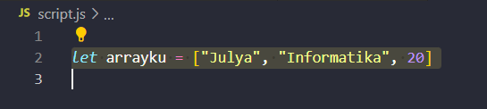

* Cara Mengakses Array

     Array pada javascript dihitung dari index data ke-0. Data pertama adalah index ke-0.Pada array diatas _arrayku_ terdapat 3 index ,index ke-0 nya adalah “Julya”, index ke-1 nya adalah "Informatika", dan index ke-2nya adalah 20. Misalnya kita ingin memanggil index ke-0 dan ke-2 caranya adalah sebagai berikut

    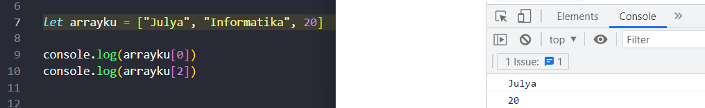


* array multidimensional
    
        Multidimensional Array bisa dianalogikan dengan array of array, ada array didalam array. Sama seperti array satu dimensi, multidimensional array juga dapat menggunakan Property dan Method built-in Array
  
    Untuk mendeklarasikan array multidimensional tidak jauh berbeda dengan array 1 dimensi
  
    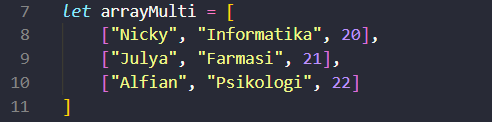

* Cara Mengakses Array Multidimensional

    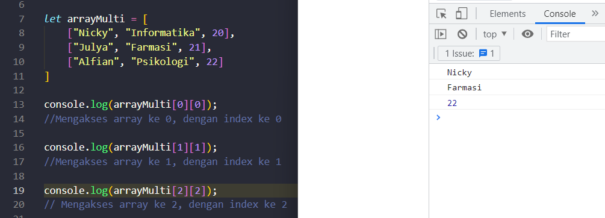

* Array property

    Properties adalah fitur yang sudah disediakan oleh Javascript untuk memudahkan developer. properti yang sering digunakan yaitu length
    length akan mengembalikan nilai dari jumlah panjang data suatu array. berikut adalah contoh memanggil properti

    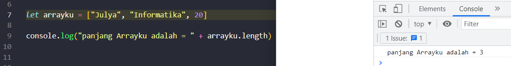

* Method array
  
    Array memiliki method atau biasa disebut built-in methods. Artinya Javascript sudah memudahkan kita dengan menyediakan function/method umum yang bisa kita gunakan. Kita tidak perlu membuat function lagi jika method yang kita butuhkan sudah tersedia.

  * .push() adalah method untuk menambahkan item array pada urutan yang paling akhir

    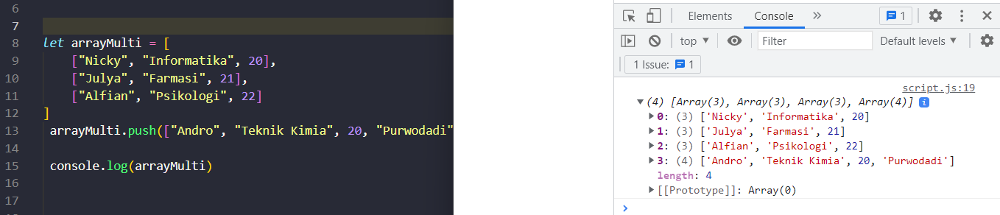

  * .pop() adalah method yang menghapus item array index terakhir.

    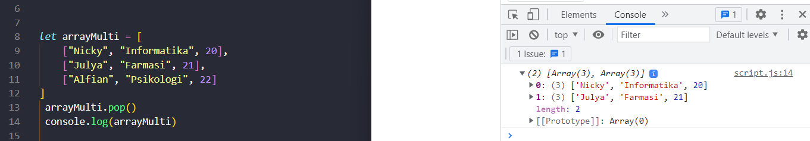

  * .shift() adalah method untuk menghapus item Array pada index pertama

    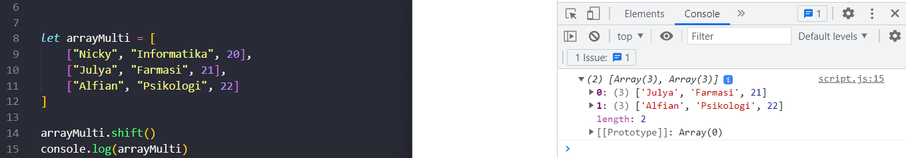

  * unshift() adalah method untuk menambahkan item Array pada index pertama

    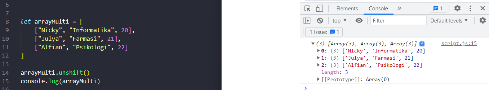

  * sort() adalah method untuk mengurutkan secara Ascending atau Descending Alphanumeric

    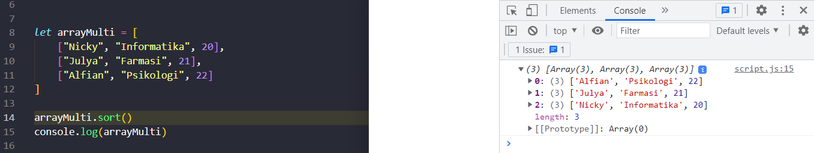

* Looping pada Array
  
    Array memiliki built in methods untuk melakukan looping yaitu .map() dan .forEach()

  * forEach() adalah method untuk melakukan looping pada setiap elemen array.

    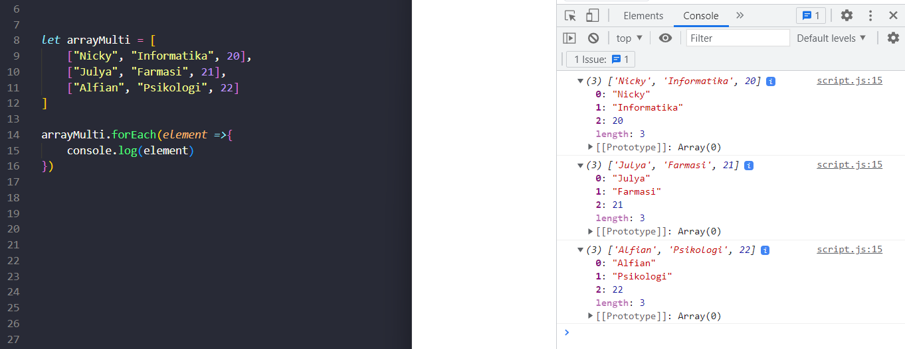

  * .map() melakukan perulangan/looping dengan membuat array baru.

    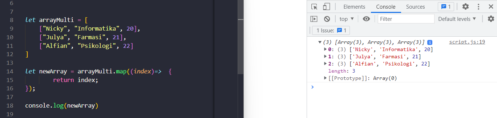

  * Perbedaan map() dan forEach()  
    .map() dan forEach() sama-sama melakukan looping dan mengembalikan nilai baru dari operasi yang dilakukan. Perbedaannya adalah .forEach tidak dapat membuat Array barudari hasil operasi yang ada dalam looping

  * Penggunaan map() dan forEach()
  
    forEach() digunakan jika hanya memerlukan looping untuk menampilkan saja atau menyimpan ke database. sedangkan .map()  digunakan jika akan melakukan operasi pada arrayseperti yang dapat mengubah nilai array sebelumnya.


# OBJECT

* Object
  
      - object adalah sebuah tipe data pada variabel yang - menyimpan properti dan fungsi (method).

      - Properti adalah data lengkap dari sebuah object.

      - Method adalah action dari sebuah object. Apa saja yang dapat dilakukan dari suatu object.

* Membuat sebuah object

  Sama seperti tipe data 
sebelumnya. Object dapat diassign kedalam sebuah variabel

  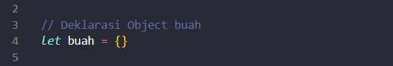

* Menambah properti pada Object Buah
  
  Sama seperti array, didalam object kita dapat menyimpan properti dengan tipe data apapun
  
  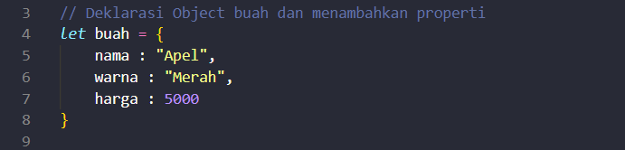

* Mengakses Object dan Property Object

  * Mengakses seluruh object

    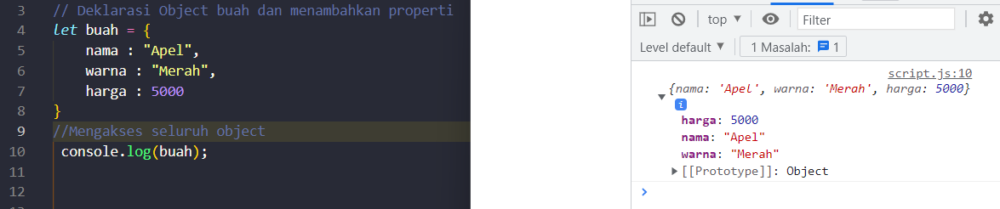

  * Mengakses properti object(tidak Semua)

    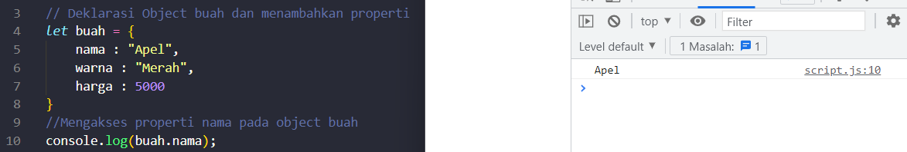

  * Menggunakan _Bracket Notation_ saat memanggil properti dari sebuah object

    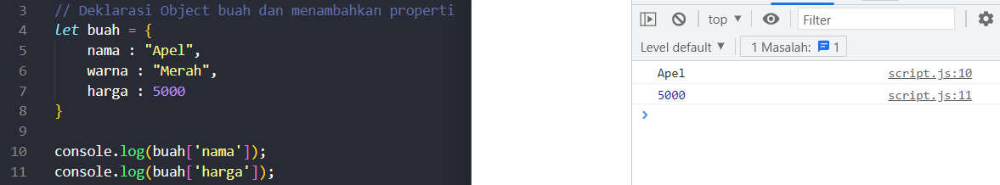

* Melakukan update pada variabel dengan tipe data _Object._

  * Do's
  
    * Object dapat mengupdate value dari key yang sudah tersedia.
    * Object dapat menambahkan key dan value baru

    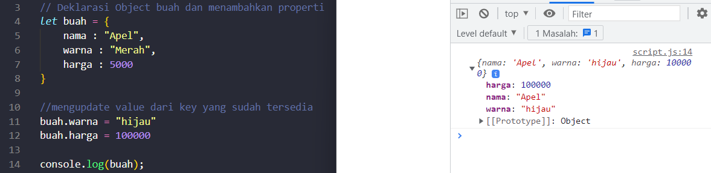

  * Dont's

    Jika menggunakan _const_ pada variable object. Kita tidak bisa mengganti seluruh data object dengan object yang baru.

    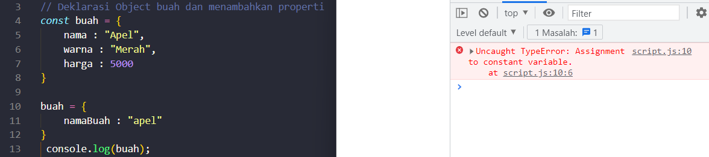

        Update data object harus menggunakan let pada deklarasi variabel

* Delete Object Property

  Menghapus properti dari object menggunakan delete operator.

  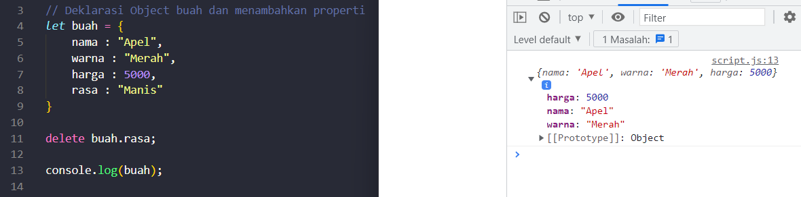

* Method

  Jika value yang kita masukkan pada property berupa function.Maka itu disebut method. 

  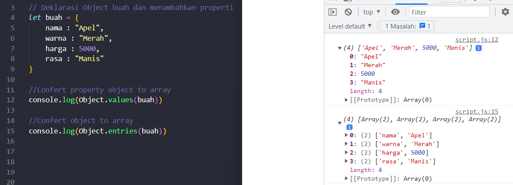 

* Nested Object
  
  Nested object adalah object yang berada didalam object

  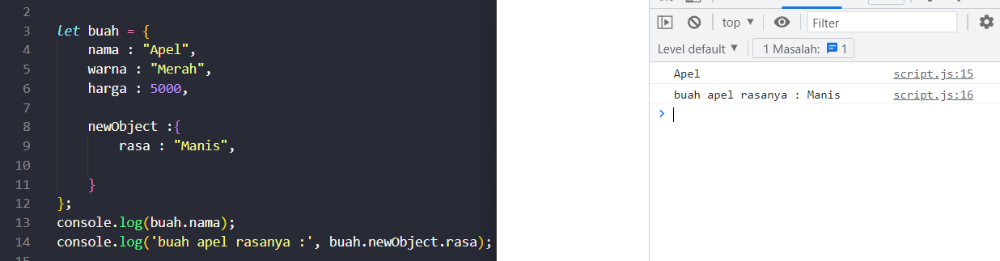

* Looping Object & Array of Object
  
  Object sama seperti Array yang bisa menyimpan banyak data. Array of object dapat digunakan untuk data yang lebih dari satu. berikut adalah contoh looping pada data array of object

  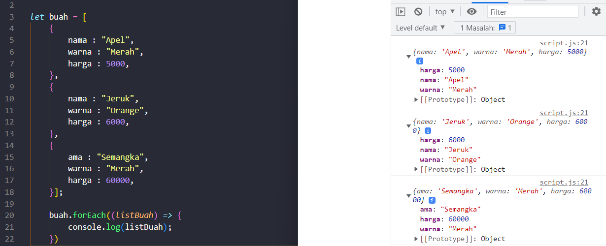


# RECURSIVE FUNCTION & MODULE JS

* Module JS

  Module adalah file Javascript yang di dalamnya terdapat value dari objects, functions, dan variables. Kemudian file tersebut dapat diexport dan diimport oleh file lain. Yang mana file lain yang mengimportnya dapat menggunakan values yang ada di file tersebut.
  
  ```Javascript
  // File hewan-buah.js
  export let hewan = ["kucing", "kuda", "kelinci", "koala"]
  let buah = ["mangga", "jambu", "pisang", "durian"]
  export default buah
  export function sayHello() {
   console.log("hallooo")
  }

  // File module.js
  import {motor} from "./hewan.js"
   console.log(hewan);
  import buah, { hewan as hewanKu, sayHello  } from "./hewan-buah.js"
  console.log(buah);
  

  Berdasarkan script diatas,
  - file module.js hanya bisa import, karena dia file utama.
  - file hewan-buah.js bisa melakukan import dan export. 
  ```


* Recursive 
  
  Recursive adalah function yang memanggil dirinya sendiri sampai kondisi tertentu. Recursive kebanyakan digunakan untuk case matematika, fisika, kimia, dan yang berhubungan dengan calculation. Recursive akan berhenti memanggil dirinya sendiri jika kondisi terpenuhi

* Struktur Recursive
  
  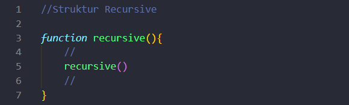

* Ciri-ciri rekursif:

  * Fungsi rekursif selalu memiliki kondisi yang menyatakan kapan fungsi tersebut berhenti. Kondisi ini harus dapat dibuktikan akan tercapai, karena jika tidak tercapai maka kita tidak dapat membuktikan bahwa fungsi akan berhenti, yang berarti algoritma kita tidak benar.
  * Fungsi rekursif selalu memanggil dirinya sendiri sambil mengurangi atau memecahkan data masukan setiap panggilannya. Hal ini penting diingat, karena tujuan utama dari rekursif ialah memecahkan masalah dengan mengurangi masalah tersebut menjadi masalah-masalah kecil.

* Fungsi rekursif perkalian

  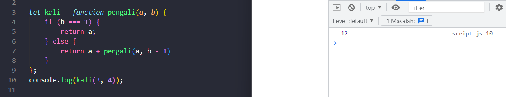


# ASYNCRONOUS

* JavaScript Asynchronous
  
  Kode asynchronous memungkinkan program untuk dieksekusi segera di mana kode sinkron akan memblokir eksekusi lebih lanjut dari kode yang tersisa sampai menyelesaikan yang sekarang. Ini mungkin tidak terlihat seperti masalah besar tetapi ketika Anda melihatnya dalam gambaran yang lebih besar, Anda menyadari bahwa itu dapat menyebabkan penundaan Antarmuka Pengguna.

  * Blocking

    Proses yang gabisa diselat

    - Proses concurrent yg tidak sama dengan multitask/multithread
    - Secara umum, bahasa pemrograman berjalan secara synchronous.
    - JS memiliki kelebihan dapat menjalankan sebuah proses tanpa harus berurutan.
    - Tiap engine JS terdiri dari 2 bagian, heap dan stack. Bersifat first in last out.

* JS Asynchronous memiliki 3 kunci utama

   * Callback
      
      Callback : function yg dijadikan sebagai argumen
      Ketika sesuatu memerlukan waktu yang lama, maka dia akan masuk kedalam callback queue lalu menjalankan proses yang berada di belakangnya. Jika proses yg belakang sudah selesai, maka engine akan memeriksa yang ada didalam callback queue untuk dijalankan.
    <br>

      Contoh :

```javascript
Console.log(“A”)
setTimeout( () => {
Console.log(“B”)
}, 1000)
Console.log(“C”)
//Output:
A
C
B
```

    Output :
    yang dikerjakan console.log(“C”) terlebih dahulu karena console.log(“B”) memerlukan waktu sebelum diproses 


  * Promise
  
    Kejadian yang telah selesai atau gagal dalam operasi asynchronous yang menghasilkan nilai Saat on progress progress dalam fase pending. Jika gagal maka status asynchronous menjadi rejected. Jika kejadian dari event asynchronous telah berhasil, maka status fulfilled.

    * ketika promise terpenuhi

      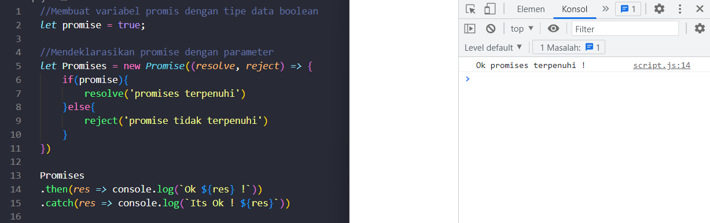

    * ketika promise tidak terpenuhi
        
      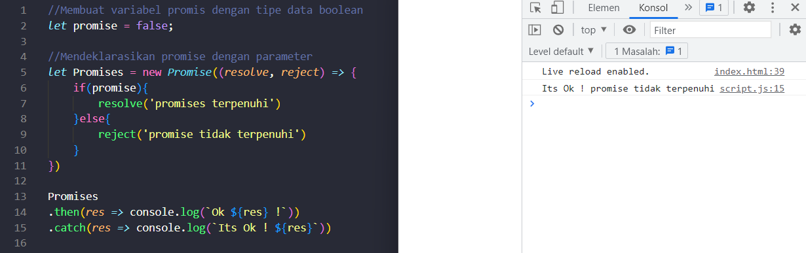


  
# Web Storage

    Web storage adalah salah satu Web API yang dapat menyimpan data secara lokal pada sisi client. Berbeda dengan objek atau array, data yang disimpan pada objek atau array JavaScript bersifat sementara, dan akan hilang jika terjadi reload atau pergantian URL pada browser.

* Cookie
  
  Cookie adalah string yang memiliki bidang nama, bidang nilai, dan atribut opsional tambahan. Cookie dapat menyimpan hingga 4096 byte data (ini termasuk nama, nilai, domain, tanggal kedaluwarsa, dan apa pun yang Anda muat di sana). Anda dapat menambahkan cookie dalam jumlah terbatas per domain yang berubah tergantung pada browser Anda.


* localStorage dan sessionStorage
  
  Objek localStorage dan sessionStorage, bagian dari API penyimpanan web, adalah dua alat hebat untuk menyimpan pasangan kunci/nilai secara lokal. Menggunakan localStorage dan sessionStorage untuk penyimpanan adalah alternatif untuk menggunakan cookie dan ada beberapa keuntungan:

  * Data hanya disimpan secara lokal dan tidak dapat dibaca oleh server, yang menghilangkan masalah keamanan yang disebabkan oleh cookie.
  * Ini memungkinkan lebih banyak data disimpan (10mb untuk sebagian besar browser).
  * Sintaksnya langsung.

  Ini juga didukung di semua browser modern, sehingga Anda dapat menggunakannya hari ini tanpa masalah. Cookie masih berguna, terutama dalam hal autentikasi, tetapi ada kalanya menggunakan localStorage atau sessionStorage mungkin merupakan alternatif yang lebih baik.

  * Membuat entri untuk objek localStorage dengan menggunakan metode setItem(). Metode setItem() mengambil dua argumen, kunci dan nilai yang sesuai:

  ```Javascript
  let key = 'Item 1';
  localStorage.setItem(key, 'Value');
  ```

  * Metode getItem() mengambil satu argumen yang harus menjadi kuncinya. Fungsi ini akan mengembalikan nilai yang sesuai sebagai string:

  ```Javascript
  let myItem = localStorage.getItem(key);
  ```

  * Menghapus entri dengan metode removeItem(). Metode removeItem() mengambil satu argumen yang akan menjadi kunci objek localStorage:

  ```Javascript
    localStorage.removeItem(key);
  ```


Terimakasih

_09 Oktober 2022 16.51 @lyalfya_


