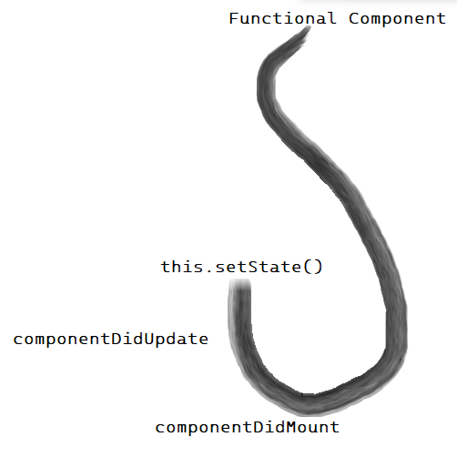

# INTRODUCTION REACT JS

## Pengertian React JS

React JS merupakan Framework view library Javascript untuk membuat tampilan(user interface) pada website.

## kelebihan React JS 
1. React JS is Fast
  
    React JS membuat aplikasi front-end menjadi lebih cepat walaupun harus menghandle berbagai data.

2. React JS is Modular
  
    React JS membagi 1 tampilan pada website menjadi komponen-komponen kecil. kita dapat menenrapkan konsep modular javascript pada React JS.

3. React JS is Scalable
  
    React JS dapat digunakan pada aplikasi berskala kecil hingga besar dan kompleks.

4. React JS is Popular
  
    Komunitas React JS di seluruh dunia sangat besar. Kebanyakan perusahaan teknologi pun sudah menggunakan React JS. Hal ini dapat mempermudah kita dalam mencari pekerjaan baik itu freelance/start up apabila kita menguasai React JS.

 ## Instalasi React JS

1. Menginstal Node JS
2. Menggunakan library React
   ```javascript
   // ketikan kode dibawah ini pada git bash
   npm create-react-app My-app

   // npm akan otomatis terinstall ketika kita sudah menginstall node js

   //ketika sudah berhasil terinstall ,maka akan ada teks 'Happy Hacking'
   ```
3. Running program pada git bash
   ```Javascript
   npm start
   ```
4. untuk membuka visual code editor(Visual studio),ketikan perintah
   ```Javascript
   code .
   ```
5. React JS siap digunakan

## Struktur Project React JS

Karena React JS membagi 1 tampilan pada website menjadi komponen komponen kecil, berikut tampilan project react js yang berhasil diinstal.


## Contoh Struktur kode dari 'App.js'

```Javascript
import './App.css';

function App() {
  return(
    <div>
      <h1 className='App'>hello world. I'am Julya</h1>
    </div>
  );
}

export default App;

```
Pada potongan kode diatas terdapat tah HTML 'h1'. Kok bisa padahal ekstensinya Javascript?

itu adalah JSX

    JSX adalah syntax Extension for javascript. JSX dikembangkan untuk digunakan pada React JS

Sebelum ditampilkan pada browser, JSX akan di compile terlebih dahulu menjadi javascript. Dengan JSX kita dapat menggunakan HTML didalam file extension Javascript(.js)

    Setiap JSX hanya bisa memiliki 1 parent element
    
contoh :

```Javascript
import './App.css';

function App() {
  return(
    // Gunakan tag element <div> sebagai sebagai parent dari element lain

    // <div> mengambil space pada web page

    <div> 
      <h1 className='App'>hello world. I'am Julya</h1>
    </div>
  );
}

export default App;

```
```Javascript
import './App.css';

function App() {
  return(
    // Gunakan tag element <> sebagai sebagai parent dari element lain jika tidak ingin ada space pada ui yang terisi
    <> 
      <h1 className='App'>hello world. I'am Julya</h1>
    </>
  );
}

export default App;
```

## Virtual DOM

React JS memiliki fitur Virtual DOM, Virtual DOM secara singkat nya adalah sebuah javascript object (virtual) yang 
merepresentasikan DOM sebenarnya (real DOM). karena virtual DOM ini adalah representasi dari real DOM maka 
virtual DOM adalah sebuah replikasi (copy) dari real DOM tersebut. Berbeda konsep dengan DOM, 
virtual DOM ini memiliki konsep yaitu setiap saat perubahan terjadi di state pada aplikasi kita maka akan membuat virtual DOM yang baru (cloning).

## Class & ClassName

    Pada JSX atribut class di tag element HTML harus menggunakan className. 

Contoh :
```Javascript
import './App.css';

function App() {
  return(
    <> 
      <h1 className='App'>hello world. I'am Julya</h1>
    </>
  );
}

export default App;

// output : hello world. I'am Julya
```

## Curly Braces/ {}

Kita bisa menggunakan syntax Javascript didalam element HTML dengan curly braces/{}.

Contoh :

```Javascript
import './App.css';

function App() {
  return(
    <> 
      <h1>{1 + 2}</h1>
    </>
  );
}

export default App;

// output : 3
```

    Element didalam tag h1 akan dianggap sebagai Javascript jika menggunakan curly braces/{}.

    Jika tidak menggunakan curly braces, maka akan dianggap sebagai file HTML

## Variabel pada JSX
 Untuk mengakses variabel yaitu menggunakan curly braces/ {}

 Contoh :

 ```Javascript
 import React from 'react'

 function MyName() {
    //deklarasi variabel
    const name = 'Julya'
    return (
        <div>
            <h1>{ name }</h1>
        </div>
    );
 };

export default MyName;

 // output : Julya
 ```

 ## Atribut pada JSX

 Untuk mengakses atribut yaitu menggunakan curly braces/ {}

 Contoh :

  ```Javascript
 import React from 'react'

 function MyName() {
    //deklarasi variabel
    const name = 'Julya'
    return (
        <div>
            <h1>{ name }</h1>
        </div>
    );
 };

export default MyName;
```

## Event di JSX

 Untuk mengakses event yaitu menggunakan curly braces/ {}

 Contoh :

```Javascript
import React from "react";

function Myname() {
  const name = 'Julya'
  const onClickFunction = () => {
    alert('you clicked');
  }

  return(
    <div> 
      <h1>{ name }</h1>
      onClick = {onClickFunction}
      
    </div>
  );
};

export default Myname;
```

## Conditional in JSX

## .map()

Salah satu fungsi map yaitu untuk menampilkan list data di react


# COMPONENT PADA REACT JS

## Pengertian Component

Component adalah salah satu core dari React JS. Component membagi UI dalam satuan satuan kecil. Artinya dalam satu page ada beberapa component yang bisa kita buat.

Component dibuat jika component tersebut bersifat reusable code. pada skala project, component dibuat apabila akan dibutuhkan pada section atau page lain. namun, untuk latihan dan masa belajar tidak masalah jika component yang kita buat belum digunakan pada section atau page lain.

## Membuat Component

Ada dua cara untuk membuat component yaitu :

1. menggunakan class
   
2. Menggunakan function(_Kebanyakan kasus dokumentasi resmi React JS merekomendasikan untuk menggunakan function_)


    Contoh :

    ```Javascript
    import './App.css';
    import MyComponent from './component';

    function App() {
        return (
            <>
                <MyComponent/>
            </>
        );
    }

    export default App;
    ```
   

   
        Nama Folder, File, dan Function component harus menggunakan huruf besar diawal dan kata selanjutnya

# REACT JS HOOKS


## Pengertian Hooks

Hooks adalah fitur baru yang baru dikenalkan di React JS pada tahun 2018.Hooks digunakan untuk memumadhkan penggunaan functional components agar bisa menggunakan state dan lifecycle lainya.

Sebelumnya, state(setState) dan lifecycle(componenDidMount, componenDidUpdate) hanya bisa digunakan di class component, namun dengan hooks, kita bisa menggunakannya di functional component.

    Hooks yang sering digunakan adalah useState dan useEffect

## Ilustrasi Hooks



Penjelasan :
functional component akan melakukan 'hooks' terhadap hal-hal yang hanya ada di class agar bisa digunakan di functional components dengan mudah.

## Perbedaan Functional Component dengan Class Component


